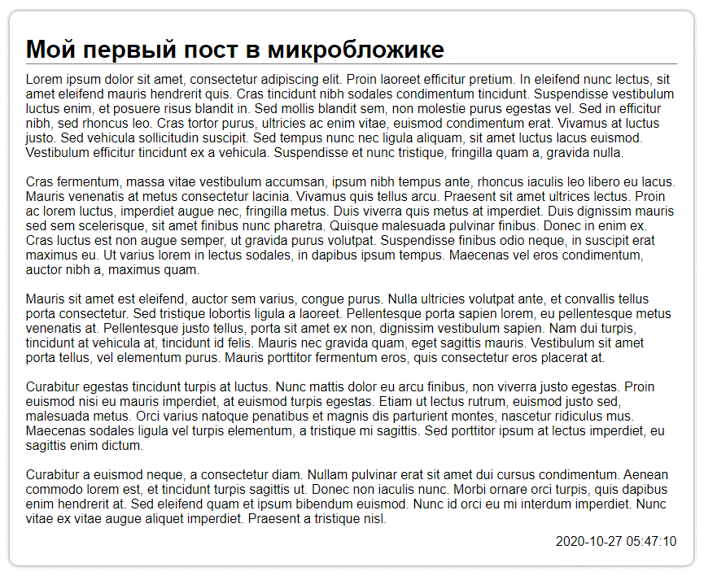
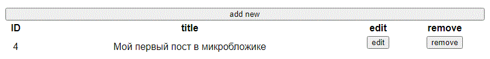
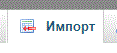

# Сегодня, текст лабораторной работы будет в md!
## Плавно переходим к работе с данными

Для начала, необходимо немного освежить знания, и установить необходимое ПО, если Вы еще этого не сделали. Все инструкции находятся в [этом](https://vk.com/wall-193402748_32) посте.

Весь необходимый код у вас уже есть, с одним НО! Потерялись функции для работы с данными, необходимо их восстановить!

### Немного по содержанию репозитория

В репозитории есть два php-файла - это странички для управления.

1. *index.php* - заглавная страница, при правильном подключении и настройке файлов, вы должны увидеть: 

2. *admin.php* - страница для редактирования бложика: 


Оба файла работают только при правильном подключении базы данных! Дамп БД хранится в файле *microblog.sql*

Обратите внимание, что в репозитории присутствует файл *.gitignore*! Это значит, что Вам необходимо самостоятельно его восстановить!

Отсутсвующий файл - это подключение к базе данных. 

### Немного помощи 

#### db_link
В обоих php-файлах присутсвует такая строка:

```php
    require "db_link.php";
```

Через этот файл мы подключаемся к БД и он не зря скрыт из репозитория, в нём хранится логин и пароль для подключения к локадбному серверу MySQL.

Также, для выполнения SQL-запросов используется метод:

```php
    mysqli_query($db_link, $sql);
```

Первый параметр - это ссылка на БД, эта ссылка формируется в файле *db_link.php*, для избежания разногласий, соблюдайте именование переменных.

Ну и в помощь, [ссылка](https://www.php.net/manual/en/function.mysqli-connect.php) на официальную документацию.

#### import

Файл *microblog.sql* необходимо импортировать на сервер MySQL, для этого:

1. сервер необходимо запустить
2. в браузере перейти по ссылке *localhost/phpmyadmin*, для входа в панель управления
3. найти вкладку "импорт": 

4. PROFIT?

### Немного самостоятельной работы


